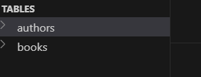
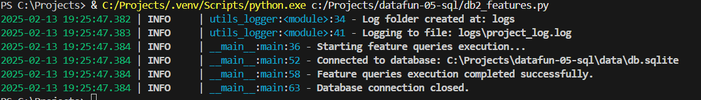
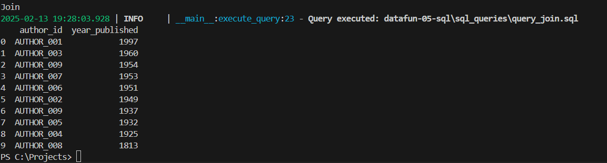

# datafun-05-sql
Project 5 SQL

# Specification for Project 5 SQL Module

## Overview

Project 5 integrates Python and SQL,
focusing on database interactions using SQLite.
The project involves creating and managing a database, building a schema, and performing various SQL operations,
including queries with joins, filters, and aggregations.

---

## Step 1: Start Project, Open in VS Code

Start a project as usual. 
1. Create a repo in GitHub with a default README.md. Name the repo **datafun-05-sql**. 
2. Clone your new repo down to the Projects folder on your machine. 
3. Open your new project repository folder in VS Code.

---

## Step 2: Add/Update Critical Files

With your new project repo folder open in VS Code, add/update critical project files at the start of every project. 

### Add/Add .gitignore

- The .gitignore file tells Git files to ignore when committing changes.
- Review/copy the example .gitignore file, you might be able to use it without modification.

### Add/Update requirements.txt

- The requirements.txt file lists the packages used in the project.
- Review/copy the example requirements.txt file, you might be able to use it without modification.
- You may not need all the listed packages - and may want to add others. Modify the requirements.txt as needed.

### Update README.md

- Edit and customize your README.md to provide an overview of the project and instructions for running it.
 
### Git add-commit-push

After adding .gitignore (or any other key file), run git add, commit, and push to commit your changes to GitHub. 

```shell
git add .
git commit -m "Add .gitignore and requirements.txt"
git push -u origin main
```

---

## Step 3: Set up Virtual Environment

Next, create and activate a virtual environment for this project. 
Also install additional dependencies required for this project.
See [requirements.txt](requirements.txt) for detailed instructions. 

A. Create .venv
B. Activate .venv
C. Install dependencies into .venv
D. Select VS Code interpreter to use .venv

## Step 4: Schema Design and Database Initialization

Design a schema with at least two related tables, including foreign key constraints.
Authors.csv & Books.csv built to db.sqlite database
Other ideas: Suppliers & Orders

# Added P5 data folder
# Added author.csv file and books.csv file

sql_create folder:

- 01_drop_tables.sql - drop tables to restart
- 02_create_tables.sql - create your database schema using sql 
- 03_insert_records.sql - insert at least 10 additional records into each table.

db1_setup.py:
- script must connect correctly to the tables in db.sqlite.



## Step 5. Cleaning and Feature Engineering

Implement SQL statements and queries to perform additional operations and use Python to execute your SQL statements.
You might create an additional table, insert new records,
and perform data querying (with filters, sorting, and joining tables),
data aggregation, and record update and deletion.

sql_features folder:

1. update_records.sql - update 1 or more records in a table.
2. delete_records.sql - delete 1 or more records from a table.

db2_features.py

Creates a Python script that demonstrates the ability to run sql scripts 
to interact with fields, update records, delete records, and maybe add additional columns. 



## Step 6. Perform Aggregations and queries

Implement SQL statements and queries to perform aggregations and queries.

sql_queries folder: 

1. query_aggregation.sql - use aggregation functions including COUNT, AVG, SUM.
2. query_filter.sql - use WHERE to filter data based on conditions.
3. query_sorting.sql - use ORDER BY to sort data.
4. query_join.sql - use INNER JOIN operation and optionally include LEFT JOIN, RIGHT JOIN, etc.
5. querylistbooks.py - use to print the list of books

Write Python to execute the SQL queries and maybe chart, illustrate, and/or summarize your findings:

db3_queries.py

